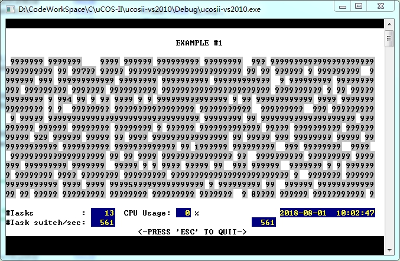

## ucosII嵌入式实时操作系统-windows模拟
更新信息请查看[github](https://github.com/phynos/ucos_ii_x86_port)

## 版权声明
ucosii源码归属查看网站:https://www.micrium.com  
windows平台移植源码归属于：http://www.it.fht-esslingen.de/~zimmerma/software/uCOS-II_WIN32.htm  
(c) Copyright 2004-... Werner.Zimmermann@fht-esslingen.de

## VS2010编译
进入VS2010文件夹打开工程直接编译运行即可  
如果编译有错误，注意2个点就行，一个是头文件包含目录，一个链接Winmm.lib

## MINGW编译
暂不支持

## 运行截图

### VS2010编译版本运行截图

### MINGW编译版本运行截图

